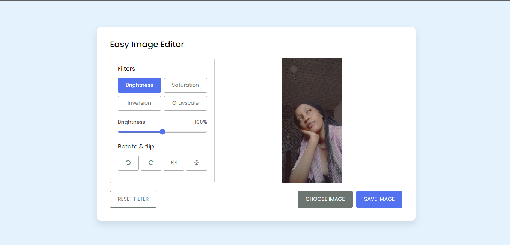

# IG marketing landing page project

This is a solution to [Coding Nepal Image Editor Project](https://youtu.be/GAdfZJEl1Vs).

## Table of contents

- [Overview](#overview)
  - [The challenge](#the-challenge)
  - [Screenshot](#screenshot)
  - [Links](#links)
  - [Built with](#built-with)
- [Author](#author)

## Overview

Easy Image Editor

### The challenge

Users should be able to:

- View the optimal layout for the site depending on their device's screen size
- See hover states for all interactive elements on the page
- Choose an image 
- Edit the image
- Save the image
- Reset the filter

### Screenshot

### Links

- Solution URL: [Git repo url]()
- Live Site URL: [Git live url]()

### Built with

- Semantic HTML5 markup
- CSS custom properties
- Flexbox
- JavaScript

## Author

- Frontend Mentor - [@Plut0r](https://www.frontendmentor.io/profile/Plut0r)
- Linkedin - [@Plutor](https://www.linkedin.com/in/plut0r)
